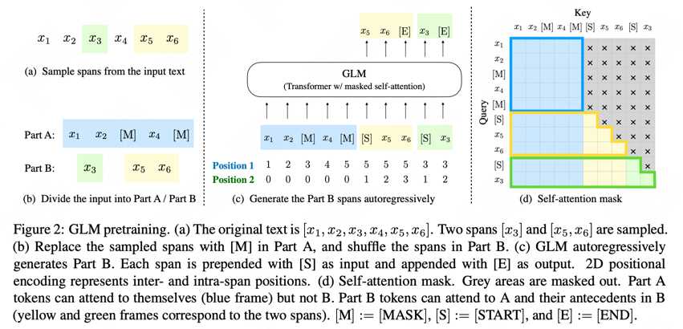
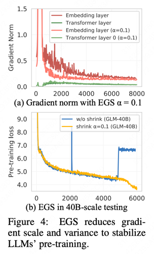
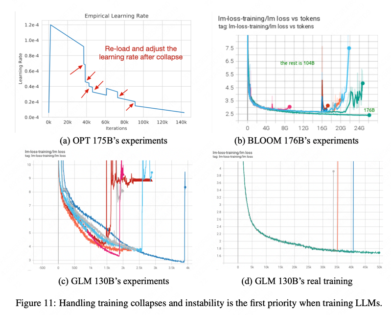
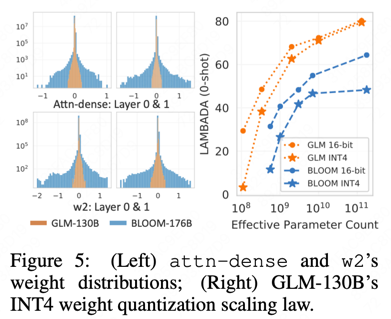
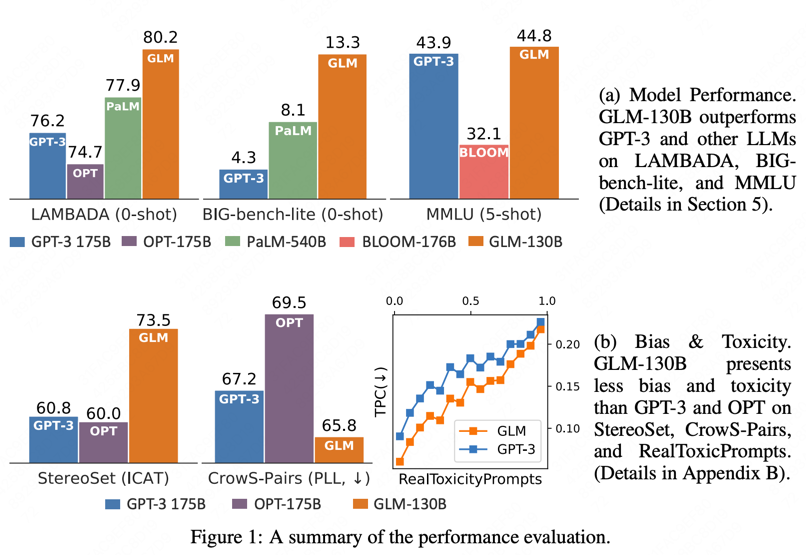
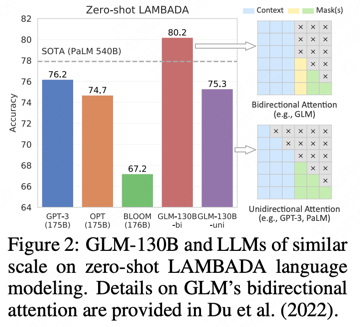
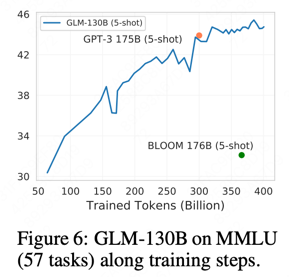
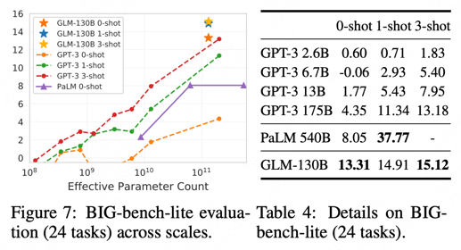
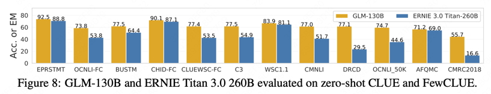

论文标题：General Language Model Pretraining with Autoregressive Blank Infilling

# 一 预训练的范式

| 序号 | 类型 | 图示 | 介绍 | 代表性模型 | 点评 |
| :---: | :---: | :---: | :---: | :---: | :---: |
| 1 | AutoEncoding | 双向语言模型的单Transformer结构 | 输入句中的未被Mask的单词两两可见，被Mask掉的单词之间相互独立，互不可见。在预测某个被Mask掉的单词时，被Mask的单词不起作用，未被Mask掉的单词都参与到当前单词的预测。 | Bert、RoBerta | 对于语言理解类的NLP任务效果最好，对于语言生成类的任务效果相对很差 |
| 2 | AutoRegressive (Language model) | 单向语言模型的单Transformer结构 | 从左到右依次预测下一个token，每个token只能看到之前的token。 | GPT系列 | 对于语言生成类的任务效果是最好的结构之一。语言理解类的任务，效果比AE结构差距非常明显。 |
| 3 | Prefix Language Model | 单一Transformer结构 | Encoder部分采用AE模式，Decoder部分采用AR模式，共享同一个Transformer结构 | UniLM、XLNet、permutation language model、GLM | Prefix LM在生成类任务表现比较突出，但在语言理解类任务相对较弱。 |
| 4 | Encoder-Decoder | 双Transformer结构 | Encoder侧采用AE的结构，Decoder侧采用AR的结构，无论是语言理解类的任务还是语言生成类的任务，效果都是最好的之一。缺点是参数量暴增。 | T5、BART | 无论是语言理解类的任务还是语言生成类的任务，Encoder-Decoder结构相对其它几种结构来说，效果都是最好的之一。 |

# 二 GLM原理

GLM通用语言模型：通过设计自回归的完形填空任务将自然语言理解(NLU)和自然语言生成(NLG)以较好的效果统一到了一个模型。

## 2.1 模型结构

1. GLM把预训练任务设计成自回归完形填空形式的灵感来源于：Pattern-Exploiting Training (PET)

2. GLM从输入文本中随机挖出几个包含连续token的span后Mask(唯一)，然后在句子末尾通过自回归的方式生成被挖出的span全部内容。

3. Part A: 原始的输入句子部分采用AE模型的双向注意力

4. Part B: 输入句子后面填空的部分采用AR模型的单向注意力

5. 相对原始Prefix LM的改进: span shuffling and 2D positional encoding。

6. span shuffling：在填空部分随机打乱span的顺序、用前面的span预测当前span，在所有组合上求期望最大。

7. 2D positional encoding：每个token两个位置嵌入向量，一个代表在被挖出span Mask后在原始句子中的位置，另一个代表在span内部的位置。

## 2.2 Finetuning GLM

1. 自然语言生成(NLU)：按照Pattern-Exploiting Training (PET)的做法，将NLU任务重新定义成自回归填空生成任务。例如，

    - a sentiment classification task can be formulated as “{SENTENCE}. It’s really [MASK]”. 

2. 自然语言生成(NLG)：在输入的句子末尾添加Mask，接着自回归生成。

    - 即生成类下游任务微调，可以直接使用预训练阶段的做法。

# 三 GLM-130B

## 3.1 预训练细节

GLM130b的实际预训练数据包含两部分：1）95%的self-supervised autoregressive blank infilling  2）5%的Multi-Task Instruction Pre-Training

_ps:  The pre-training data includes 1.2T Pile English corpus, 1.0T Chinese Wudao Corpora, and 250G Chinese corpora (including online forums, encyclopedia, and QA) we crawl from the web, which form a balanced composition of English and Chinese contents._

为了同时支持自然语言理解和自然语言生成任务，设计了2种形式的mask任务：

1. [MASK]: short blanks in sentences whose lengths add up to a certain portion of the input.

   _ps: The lengths of spans follow a Poisson distribution (λ = 3) and add up  to 15%(和bert做法一致) of the input._

2. [gMASK]: random-length long blanks at the end of sentences with prefix contexts provided.

   _ps: The masked length is sampled from the Uniform distribution._

 其中，第一种占blank infilling数据的30%；第二种占70%。

## 3.2 训练困难

预训练：96 DGX-A100 GPU (8×40G) servers with a 60-day access。400 billion tokens (roughly 200 billion each for Chinese and English)。

1. 增强训练稳定性的结构改进

    - Layer Normalization：实验发现Pre-LN(bloom/GPT3/Opt/PaLM)、Post-LN(原始的transformer的方式)在GLM的结构下都无法使训练稳定。庆幸的是，尝试了基于 DeepNorm(Deepnet)中提出的方法(结合了Pre-LN和Post-LN优势)，来初始化Post-LN的方式可以让训练过程稳定。

                           

2. Positional Encoding and FFNs：出于同时考虑训练稳定性和下游任务性能的考虑开展实验。

    1. 位置编码采用了RoPE(Roformer)，BLOOM采用的ALiBi、PaLM采用RoPE、GPT3原始的APE。

    2. 前馈层使用的是基于GELU激活的GLU、PaLM使用的是SwiGLU、Opt/GPT/BLOOM使用的是transformer原始的FFN。

3. 解决训练过程中的损失突刺(loss spikes)现象

采用了和OPT-175B 、BLOOM-176B相同的混合精度训练，产生了与之相同的loss spikes。

ps: FP16 for forwards and backwards and FP32 for optimizer states and master weights, to reduce the GPU memory usage and improve training efficiency.

**GLM-130B预训练随着训练推移会频繁的出现loss spikes。** 

出现原因?:

1. Such spikes are usually caused by the embedding layer’s abnormal gradients, as we observe that its gradient norm is often several magnitude larger that those of other layers in GLM-130B’s early stage training.    ps: 模型越scale up越容易出现。

2. In addition, it tends to fluctuate dramatically in the early training.

怎么解决?

| Model   | Method                                                  | Note                                                                       |
| ------- | ------------------------------------------------------- | -------------------------------------------------------------------------- |
| OPT-175B | manually skipping data and adjusting hyper-parameters | -                                                                          |
| BLOOM-176B | via the embedding norm technique                        | will sacrifice a significant penalty on model performance.                |
| GLM-130B | Embedding Layer Gradient Shrink (EGS)                    | -                                                                          |

-

在40B规模上实验的EGS效果对比见上图（b）

使用了EGS后，GLM-130B最终的训练只出现了3次loss spikes，验证了EGS对稳定GLM-130B训练的有效性。

                        

## 3.3 推理优势

1. Why 130B? 

    As mentioned, the model size of 130B is determined for running the full GLM-130B model on a single A100 (40G×8) server, rather than the high-end A100 (80G×8) machine required by OPT-175B and BLOOM-176B. 

2. Inference Speed

   1) leverage FasterTransformer (paper:) to implement GLM-130B in C++.

   2) 7-8.4× faster then BLOOM-176B Huggingface API on the same single A100 serve

3. Quantization

    ps: 论文表示GLM-130B量化到INT4还是可以保持较低的精度损失、OPT和BLOOM176B做不到INT4维持较低精度损失。原应参考下图左。

   1) INT4 Quantization for RTX 3090s/2080s. Thus allowing GLM- 130B inference on 4 × RTX 3090 Ti (24G) or 8 × RTX 2080 Ti (11G).

   2) GLM’s INT4 Weight Quantization Scaling Law. 参考下图右。

                                                                           

## 3.4 130B的效果

   

1. LANGUAGE MODELING

LAMBADA（FIG2）   Pile BPB(Table 3)

2. MASSIVE MULTITASK LANGUAGE UNDERSTANDING (MMLU)（FIG6）

3. BIG-BENCH

4. CLUE（FIG8）

